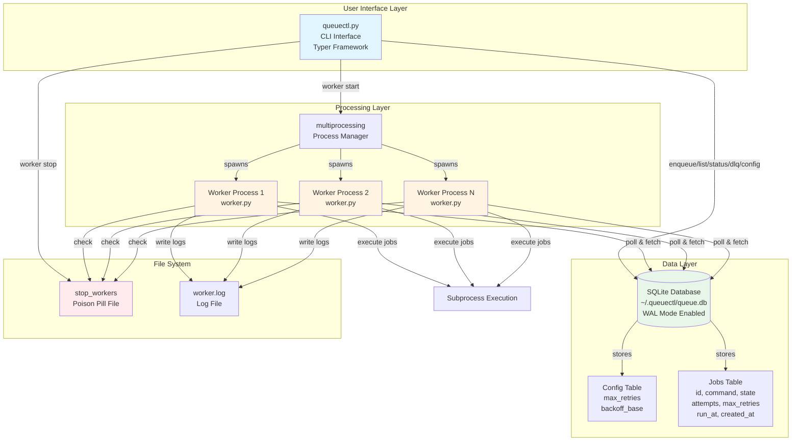
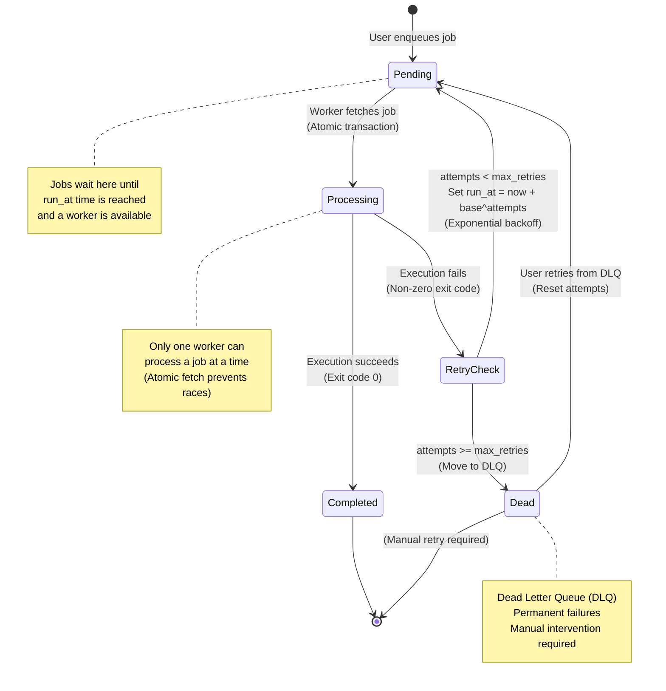
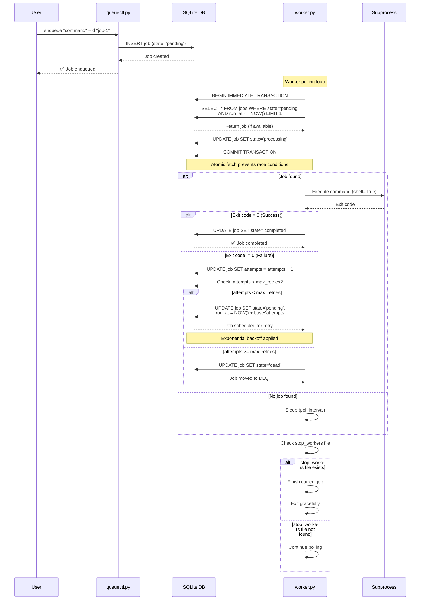
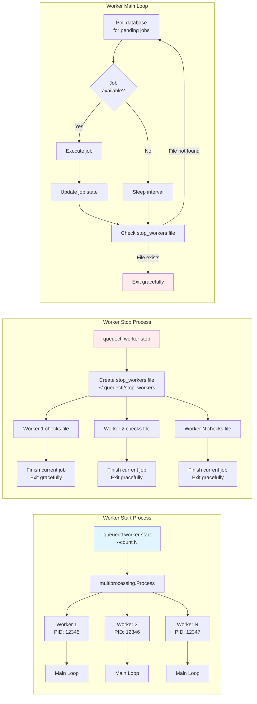
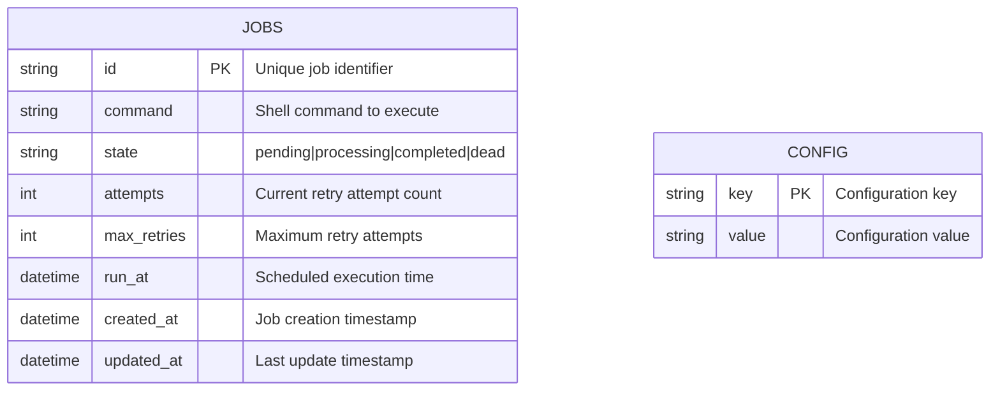
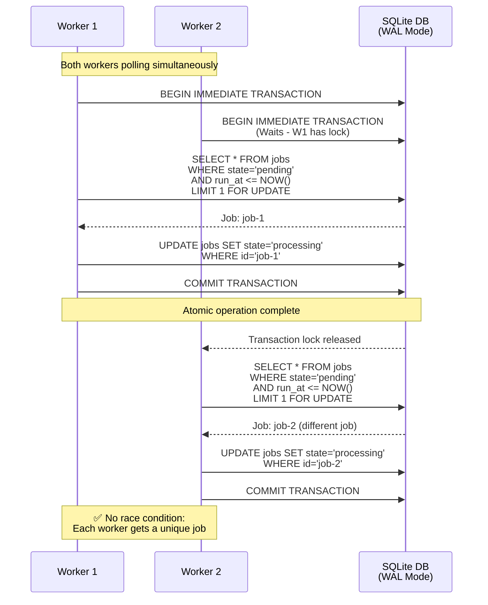
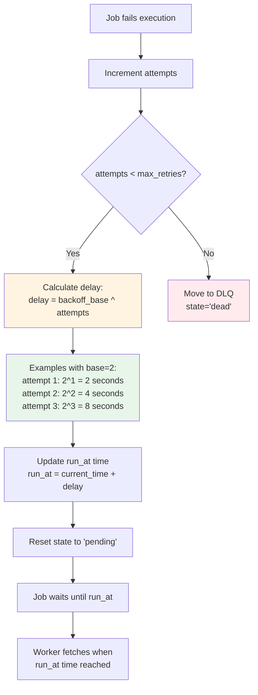
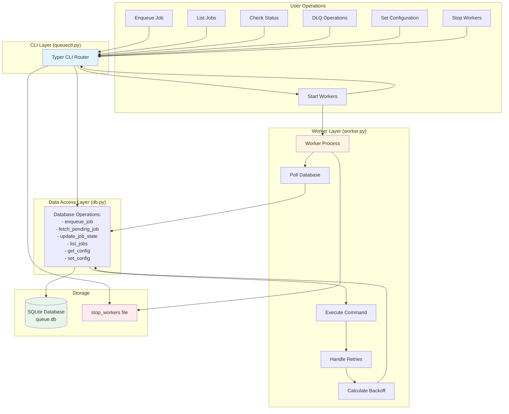

# queuectl Architecture Diagrams

This document provides comprehensive architecture diagrams for the queuectl background job queue system.

---

## System Architecture Overview

---

## Job Lifecycle State Machine

---

## Complete Job Execution Flow

---

## Worker Management Flow

---

## Database Schema & Concurrency Model

### State Transitions

The `JOBS` table tracks jobs through the following state transitions:

- **pending** → **processing** → **completed** (successful execution)
- **pending** → **processing** → **pending** (retry with exponential backoff)
- **pending** → **processing** → **dead** (moved to DLQ after max retries)
- **dead** → **pending** (manual retry from DLQ)

### Configuration Defaults

The `CONFIG` table stores system-wide settings:

- `max_retries`: Default maximum retry attempts (default: 3)
- `backoff_base`: Base for exponential backoff calculation (default: 2)

---

## Concurrency & Race Condition Prevention

---

## Exponential Backoff Calculation

---

## Complete System Interaction Flow

---

## Key Architectural Decisions

### 1. **SQLite over JSON**
- **Reason:** Atomic transactions prevent race conditions
- **Benefit:** Multiple workers can safely fetch jobs concurrently
- **Implementation:** `BEGIN IMMEDIATE ... COMMIT` transactions

### 2. **Poison Pill Shutdown**
- **Reason:** Graceful worker termination without losing jobs
- **Benefit:** Workers finish current job before exiting
- **Implementation:** File-based signal (`~/.queuectl/stop_workers`)

### 3. **Exponential Backoff**
- **Reason:** Prevent overwhelming system with failed retries
- **Benefit:** Gradually increasing delays reduce load
- **Implementation:** `delay = base ^ attempts` seconds

### 4. **Atomic Job Fetching**
- **Reason:** Prevent multiple workers from processing same job
- **Benefit:** Guaranteed job uniqueness per worker
- **Implementation:** Transaction with `FOR UPDATE` lock

### 5. **WAL Mode**
- **Reason:** Enable concurrent reads and writes
- **Benefit:** Multiple workers can operate simultaneously
- **Implementation:** SQLite WAL (Write-Ahead Logging) enabled

---

## Component Responsibilities

| Component | Responsibility | Key Functions |
|-----------|---------------|---------------|
| **queuectl.py** | CLI Interface | - Parse user commands - Route to appropriate operations - Display formatted output - Manage worker processes |
| **worker.py** | Job Execution Engine | - Poll database for jobs - Execute shell commands - Handle retries and backoff - Graceful shutdown |
| **db.py** | Data Persistence | - Database initialization - Job CRUD operations - Atomic job fetching - Configuration management |

---

## Data Flow Summary

1. **Enqueue Flow:** User → CLI → DB (insert pending job)
2. **Execution Flow:** Worker → DB (atomic fetch) → Subprocess → DB (update state)
3. **Retry Flow:** Worker → Calculate backoff → DB (update run_at) → Wait → Fetch again
4. **DLQ Flow:** Worker → Max retries reached → DB (state='dead') → User → CLI → DB (retry)
5. **Shutdown Flow:** User → CLI → Create stop file → Worker → Check file → Exit gracefully

---

*This architecture ensures reliability, concurrency safety, and graceful error handling while maintaining simplicity and ease of use.*

